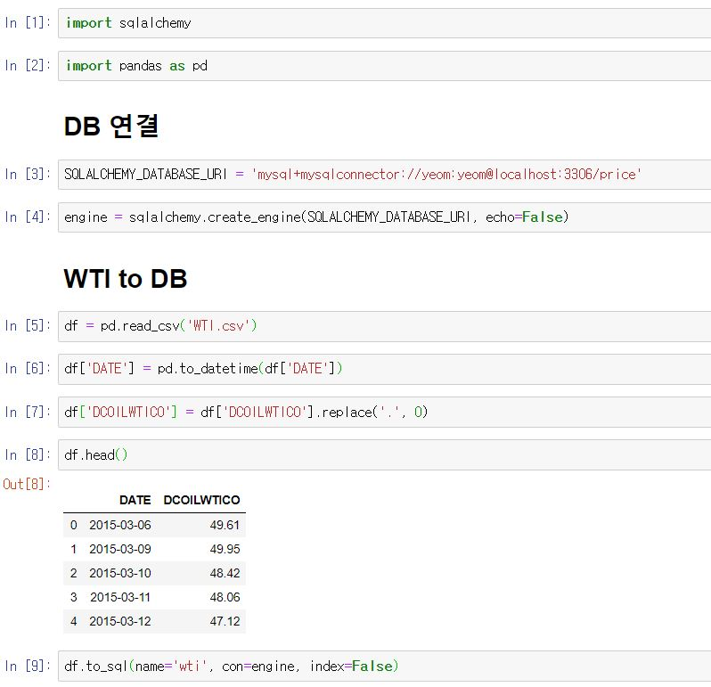

MySQL workbench나 console 등을 활용해서 DB에 데이터를 Insert 할 수도 있지만 파이썬의 경우에는 여러 패키지를 활용해서 DB에 접근할 수도 있습니다.  

여기서는 sqlalchemy를 사용해서 DB에 데이터(WTI, 서부 텍사스 중질유)를 Insert 해보도록 하겠습니다. 

[sqlalchemy.org](sqlalchemy.org)에서는 sqlalchemy를 어플리케이션 개발자들에게 SQL의 유연성과 파워풀함을 제공해주는 파이썬 toolkit 또는 ORM(Object Relational Mapper)라고 표현했네요. 

저는 Anaconda3 환경에서 진행했습니다.

# 1. DB user 생성 및 권한 부여

여기서 DB는 [MariaDB 10.4.12 버전](https://downloads.mariadb.org/)을 설치해 사용했습니다. DB 설치법을 다루지는 않겠습니다.  

먼저,  아래와 같은 명령어로 user를 생성합니다. user 이름과 비밀번호를  동일하게 `yeom`으로 만들겠습니다. 

```
CREATE USER 'yeom' IDENTIFIED BY 'yeom';
```

 이제 데이터를 넣을  `price` database를 생성하도록 하겠습니다.

```
CREATE DATABASE price;
```

user `yeom`이 `price`  database에 접근할 수 있는 권한을 부여하도록 하겠습니다. 

권한을 주지 않으면 `Access Denied` 오류가 발생할 수 있으므로 이를 방지하고자 함입니다.

```
GRANT ALL PRIVILEGES ON alchemy.* TO 'yeom'@'%';
```

위 명령어에서 `%`를 `localhost`로 대체해 쓸 수 있지만,  유효한 호스트를 더 명확히 표현할 수 있기에 사용했습니다.  

DB에서의 설정은 모두 끝이 났습니다.


# 2. sqlalchemy 설치 및 활용

저는 anaconda의 jupyter 환경에서 작업을 진행했으므로 conda prompt에서 sqlalchemy를 설치하였습니다. 

아래 명령어로 설치를 완료해줍니다. 저 같은 경우에는 `sqlalchemy 1.3.9`가 설치되었습니다.

```console
conda install sqlalchemy
```

 먼저 코드 부터 살펴보겠습니다. 아래 코드가 전부입니다.



 `DB 연결` 부분부터 살펴보겠습니다. 

`SQLALCHEMY_DATABASE_URI` 변수에 할당하는 string은 입력한 내용을 분리하면 

- `mysql+mysqlconnect`: 사용할 DB를 선언, 
- `yeom:yeom`: 각각 DB의 user 이름, password 정보
-  `localhost:3306`: 각각 host와 port번호
-  `price`: 사용할 DB 이름

으로서 일종의 `configuration`을 정의해 주는 것입니다. 

이를 `create_engine` 메소드를 통해서 dataframe에게 DB 정보를 건내줄 `engine` 변수를 만들게 됩니다. 

 `WTI to DB` 부분에서는 미리 다운로드 받은 [WTI.csv](https://fred.stlouisfed.org/series/DCOILWTICO) 데이터를 pandas를 통해 dataframe 형식으로 읽어 들입니다. 

간단한 전처리 후에 `to_sql` 메소드를 통해 DB에 데이터를 Insert합니다. 

여기서 `name`은 database 테이블의 이름으로서 테이블이 존재하지 않으면, 테이블을 만들어 데이터를 Insert하게 됩니다. 

`con`은 위에서 만든 `engine` 변수를 던져주고, `index=False`함으로써 dataframe의 index는 Insert하지 않음을 명시해주게 되었습니다.


 데이터가 DB에 들어갔는지 확인해 보고 마치도록 하겠습니다.

