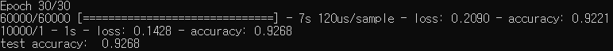
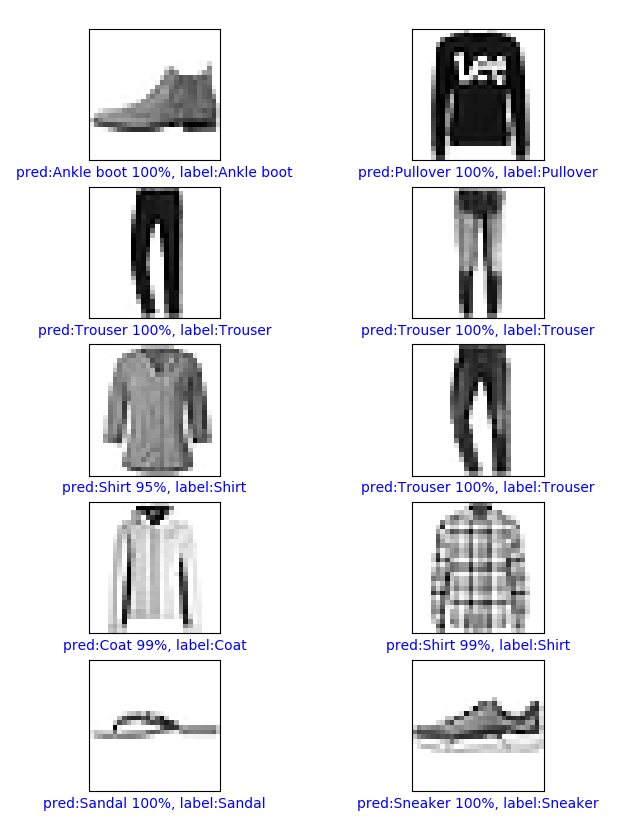

이번 시간에는 `tensorflow 2.0`으로 `Fashion MNIST` 데이터를 분류하는 모델을 만들어 보도록 하겠습니다. 많은 분들이 알고 계시는 `MNIST`는 0~9까지의 숫자(digit)를 분류하는 문제에 사용되는 데이터셋입니다. 

`Fashion MNIST`는 28x28의 크기를 가지는 이미지로서 10가지 종류의 드레스, 코트, 부츠 등을 분류하는 문제에 사용됩니다. 정확한 label은 [fashion mnist github](https://github.com/zalandoresearch/fashion-mnist)에서 확인할 수 있습니다. `학습 데이터 6만장`, `테스트 데이터 1만장`을 갖추고 있습니다.

아래는 많은 부분[tensorflow tutorial classification](https://www.tensorflow.org/tutorials/keras/classification)에 있는 내용을 참고하였습니다. 다른 점은 예제는 단순 `Dense` layer만을 사용했는데(약 89%의 테스트 정확도) 성능 향상을 위해서 이를 `Conv` layer로 바꾼 것입니다. 먼저 실행하기 위해 필요한 것들을 설치해 보겠습니다.


## 1. 설치

Anaconda 3이 설치되었다는 가정에서 `Anaconda prompt`를 실행하고 `Tensor`라는 이름으로 `파이썬 3.7버전`의  `conda 가상환경`을 만들어 주고 가상환경을 활성화하겠습니다.

```
conda create -n Tensor python=3.7
conda activate Tensor
```

그리고 `tensorflow-gpu 2.0.0 버전`을 포함해 필요한 라이브러리들을 설치해 주겠습니다. 참고로 `Anaconda prompt`에서 코드를 실행하지 않으면 `tensorflow-gpu`를 인식 못해 에러가 발생할 수도 있습니다. 

(정확한 원인은 아직 모르겠습니다. Pycharm에서 conda 가상환경을 가져와 실행했을 때 `cudart64_100.dll not found`와 같은 에러가 발생했습니다. `tensorflow-gpu`를 설치할 때 함께 설치된 `cudnn` 등을 인식 못하는 것 같습니다.)

```
conda install tensorflow-gpu==2.0.0 numpy matplotlib
```

저 같은 경우에는

- tensorflow-gpu 2.0.0
- numpy 1.18.1
- matplotlib 3.1.3

이 설치되었습니다.


## 2. Fashion Mnist 데이터 가져오기

데이터를 가져오는 것은 `tensorflow` 라이브러리에서 함수를 불러오면 train 이미지, train 라벨, test 이미지, test 라벨 순서대로 가져올 수 있습니다. 정답 라벨은 미리 `class_names`로 변수를 만들어 주겠습니다.

```
from tensorflow import keras
import numpy as np
import matplotlib.pyplot as plt
from fashion_mnist_plot import plot_image

(train_images, train_labels), (test_images, test_labels) = keras.datasets.fashion_mnist.load_data()

class_names = ['T-shirt/top', 'Trouser', 'Pullover', 'Dress', 'Coat',
               'Sandal', 'Shirt', 'Sneaker', 'Bag', 'Ankle boot']
```

그리고 0 ~ 255 사이에 분포한 픽셀 값을 0 ~ 1 사이의 값을 가지게 하기 위해 255로 나누어 정규화를 실시합니다.

```
train_images = train_images / 255.0
test_images = test_images / 255.0
```

`Conv` layer를 갖는 모델을 만들기 이전에 train 이미지, train 라벨, test 이미지, test 라벨의 차원을 1 증가 시키도록 하겠습니다. 모델 처음에 생성된 `Conv` layer는 input이 4차원일 것이라 기대하는데 현재 이미지는 3차원이기 때문입니다.

```
train_images = np.expand_dims(train_images, -1)
train_labels = np.expand_dims(train_labels, -1)
test_images = np.expand_dims(test_images, -1)
test_labels = np.expand_dims(test_labels, -1)
```

`numpy`의 `expand_dims`함수의 경우에 첫 번째 인자에 `numpy array`를 넣고, 두 번째 인자를 차원을 증가시킬 `axis`를 설정할 수 있습니다. 이에 대한 내용은 `axis`를 인자로 받는 numpy 함수들을 예로 들어 나중에 더 자세히 정리해보도록 하겠습니다.


## 3. 분류 모델 구성

분류 모델은 기존 예제에서 `Dense` layer만을 사용했던 것에 `Conv` layer를 추가하였습니다. `Conv` - `MaxPooling` - `Dropout`를 3번 반복하는 단순한 구조이고, 마지막에 `Dense` layer를 사용해 완전연결계층(FC layer)를 구성했습니다.

```
model = keras.Sequential([
    keras.layers.Conv2D(32, (3, 3), padding='same', activation='relu', input_shape=(28, 28, 1)),
    keras.layers.MaxPooling2D(pool_size=2),
    keras.layers.Dropout(0.3),
    keras.layers.Conv2D(64, (3, 3), padding='same', activation='relu'),
    keras.layers.MaxPooling2D(pool_size=2),
    keras.layers.Dropout(0.3),
    keras.layers.Conv2D(128, (3, 3), padding='same', activation='relu'),
    keras.layers.MaxPooling2D(pool_size=2),
    keras.layers.Dropout(0.3),
    keras.layers.Flatten(),
    keras.layers.Dense(256, activation='relu'),
    keras.layers.Dropout(0.5),
    keras.layers.Dense(10, activation='softmax'),
])

model.compile(optimizer='adam', loss='sparse_categorical_crossentropy', metrics=['accuracy'])
```

활성화 함수에 `relu`를 사용하고 `conv` layer의 채널 개수를 `32` - `64` - `128`로 순차적으로 증가시켜 나갔습니다. optimizer는 `adam`를, loss function에는`sparse_categorigcal_crossentropy`를 사용하였습니다.


## 4. 학습 및 평가

epochs에는 총 `30회`, 배치 사이즈를 `64개`로 설정하여 실험을 진행했습니다.

```
model.fit(train_images, train_labels, epochs=30, batch_size=64)

test_loss, test_acc = model.evaluate(test_images, test_labels, verbose=2)
print('test accuracy: ', test_acc)
```

그 결과, 약 92.7%로 분류 성능이 향상되었습니다.




## 5. 분류 결과 시각화

약 92.7% 성능을 갖는 fashion mnist 분류 모델에 10개의 이미지를 시각화해서 그 결과를 살펴보겠습니다.

```
# fashion_mnist_plot.py
import numpy as np
import matplotlib.pyplot as plt


def plot_image(i, predictions_array, true_label, img, class_names):
    predictions_array, true_label, img = predictions_array[i], true_label[i], img[i]
    plt.grid(False)
    plt.xticks([])
    plt.yticks([])

    plt.imshow(img, cmap=plt.cm.binary)

    predicted_label = np.argmax(predictions_array)
    if predicted_label == true_label:
        color = 'blue'
    else:
        color = 'red'

    plt.xlabel("pred:{} {:2.0f}%, label:{}".format(class_names[predicted_label],
                                         100 * np.max(predictions_array),
                                         class_names[true_label]), color=color)
```

```
from fashion_mnist_plot import plot_image

predictions = model.predict(test_images)

train_images = np.squeeze(train_images, -1)
train_labels = np.squeeze(train_labels, -1)
test_images = np.squeeze(test_images, -1)
test_labels = np.squeeze(test_labels, -1)

num_rows = 5
num_cols = 2
num_images = num_rows*num_cols
plt.figure(figsize=(2 * 2 * num_cols, 2 * num_rows))
for i in range(num_images):
    plt.subplot(num_rows, 2 * num_cols, 2 * i +1)
    plot_image(i, predictions, test_labels, test_images, class_names)
plt.show()
```

원활한 시각화를 위해서 이전에 `expand_dims` 함수로 차원을 증대시킨 것을 `squeeze` 함수를 사용해서 원래대로 돌려 놓도록 합니다.  결과를 살펴보면 비교적 잘 물체를 분류할 수 있음을 알 수 있습니다.

