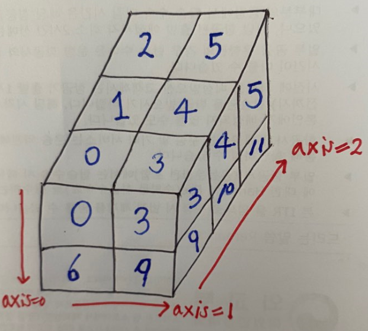

 numpy의 메소드 중에서 axis를 parameter로 받아 들이는 것들이 있습니다. 이번 시간에는 axis가 의미하는 바를 코드와 그 출력을 통해 알아보고 axis를 인자로 받는 메소드의 종류를 몇 가지 알아보도록 하겠습니다.


## 1. axis의 이해

 `axis`는 사전에서 정의하기로 `사물의 축`, `중심축`을 가리킵니다. [Scipy 용어집](https://docs.scipy.org/doc/numpy-1.13.0/glossary.html)에서는 다음과 같이 정의합니다. axis는 1차원 이상을 갖는 array에 대해서 정의되는데, `2차원 array`의 경우에는 row를 건너건너(아래로) 수직 아래 방향으로 작용하는 `axis=0`과 col를 건너건너(옆으로) 수평방향으로 작용하는 `axis=1`를 정의할 수 있습니다.

 어렸을 때부터 군대에 있을 때까지 행과 열을 구분하는 것이 너무 힘들었는데, 참고로 row는 `행(가로)`를 의미하고, col는 `열(세로)`를 의미합니다.


### 1. 2차원 array

 array의 요소들의 합을 구하는 단순한 메소드인 `sum` 을 예로 axis를 보다 자세히 이해해 보겠습니다.  먼저, numpy 2차원 array를 정의하겠습니다.

```
import numpy as np

nums = np.array(
    [[0,  1,  2],
     [3,  4,  5],
     [6,  7,  8],
     [9, 10, 11]]
)
```

 위 array의 shape를 살펴보면 `(4, 3)`입니다. 해당 array가 2차원이며 row를 4개 갖고, col를 3개 갖는다고 이해할 수 있습니다. 이 array에 `np.sum`에 axis를 명시해  함수를 실행하면 다음과 같은 결과를 보실 수 있습니다.

```
print(np.sum(nums, axis=0)) 
# array([18, 22, 26])

print(np.sum(nums, axis=1))
# array([ 3, 12, 21, 30])
```

  `axis=0`을 적용한 `sum`의 경우에는 `수직 방향`으로 `0 + 3 + 6 + 9`, `1 + 4 + 7 + 10` 등을 합산한 `1차원 array 결과값(한 차원 감소)`을 나타내고, `axis=1`을 적용한 `sum`의 경우네는 `수평 방향`으로 `0 + 1 + 2`, `3 + 4 + 5` 등을 합산한 1차원 array 결과값을 나타냅니다.


### 2. 3차원 array

 3차원 array에서의 `sum`을 살펴보겠습니다. 벌써부터 머리가 아픕니다. 먼저 코드를 실행하고 직관적으로 이해해 보겠습니다. 다음과 같이 3차원 numpy array을 선언하겠습니다.

```
nums = np.array(
    [[[0, 1, 2], [3, 4, 5]], [[6, 7, 8], [9, 10, 11]]]
)
```

 위 array의 shape은 `(2, 2, 3)`입니다. 3차원이 된 만큼 axis도 0~2까지 적용할 수 있습니다. 새롭게 추가된 `axis=2`를 `channel 방향`이라 하겠습니다. 참고로 axis에 -1을 입력하면 마지막 방향(여기서 axis 2)이 선택됩니다. 

 차원이 커진만큼 이제 머리로는 이해하기 힘들어졌습니다. 그림으로 직접 그려보겠습니다. 그야말로 발로 그린 거 같습니다.



 보이지 않는 7과 8은 6에 감춰져 보이지 않습니다. 아무튼 사진에 표시된 빨간색 글씨의 `axis`의 방향대로 `sum`이 진행될 거 같습니다. 결과를 보겠습니다.

```
print(np.sum(nums, axis=0)) 
# array([[ 6,  8, 10],
#        [12, 14, 16]])

print(np.sum(nums, axis=1))
# array([[ 3,  5,  7],
#        [15, 17, 19]])

print(np.sum(nums, axis=2))
# array([[ 3, 12],
#        [21, 30]])
```

  `axis=0`을 적용한 `sum`의 경우에는 처음 col을 기준으로 `수직 방향`으로 `0 + 6`, `1 + 7` 등을 합산해 채널 방향으로 합산이 끝나면 하나의 `array`로 구성하고 다음 col로 넘어가는 모습을 볼 수 있습니다.

 `axis=1` 경우에는 처음 row을 기준으로 `수평 방향`으로 `0 + 3`, `1 + 4` 등을 합산해 채널 방향으로 합산이 끝나면 하나의 `array`로 구성하고 다음 row로 넘어가는 모습을 볼 수 있습니다.

 `axis=2` 경우 row와 col이 고정된 채로 채널 방향으로 합산해 하나의 원소를 구성하는 모습을 구성하게 됩니다. 같은 row이면 하나의 `array`로 포함되는 군요.

 네. 간단한 함수를 사용하고 있지만 차원이 올라가면서 그 함수의 결과를 예상하는 것도 어렵네요. 하물며 4차원은 어떨까요. jupyter notebook에 쳐보며 결과를 확인해보면서 진행하길 바랍니다.


## 2. axis를 인자로 갖는 numpy 메소드

 그렇다면 axis를 인자로 사용하는 numpy 메소드는 무엇이 있을까요? 위에 `sum`이 있으니 당연히 평균(`mean`)도 있고, 최댓값(`max`)도 있고, 표준편차(`std`)도 정렬 기능을 제공하는 `sort`도 있습니다. 이번에는 일반적인 메소드말고 다른 메소드를 알아보겠습니다. 


### 1.  np.expand_dims

 `expand_dims`는 이름에서 추측할 수 있듯이 차원을 늘리는 함수입니다. 무언가 array를 array로 한번 더 감싸는 느낌입니다. `expand_dims`는 `axis`를 필수적으로 입력해야 합니다. 1차원 array를 `axis=0`과 `axis=1`로 `expand_dims`하는 두가지 예제를 함께 보겠습니다. 1차원 array의 shape은 `(2, )`입니다.

```
nums = np.array([4, 6])

axis_0 = np.expand_dims(nums, axis=0)
print(axis_0)
# array([[4, 6]])

axis_1 = np.expand_dims(nums, axis=1)
print(axis_1)
# array([[4], [6]])
```

  와닿지 않습니다. `axis_0`와 `axis_1`의 shape를 확인해보면 각각 `(1, 2)`와 `(2, 1)`로 나타납니다. 정해준 axis에 따라 차원이 추가된 것이라 이해하면 될 거 같습니다.


### 2. np.squeeze

 `expand_dims`의 대항마 `squeeze`입니다. 이름처럼 쫙 짜주어 차원을 감소시켜 주는 역할을 합니다. `expand_dims`와는 다르게 `axis` 인자가 필수적이지는 않습니다. `expand_dims`와 반대라고 생각되지만 단일 차원의 `entry`들만 제거해주는 역할을 한다고 합니다. `(1, 3, 1)`을 shape로 갖는 array을 만들어 보겠습니다.

```
nums = np.array([[[4], [5], [6]]])
```

 `squeeze` 말 그대로 `shape`에서 1을 제거해주는 역할이라고 생각하시면 됩니다. `nums` 변수를 `squeeze`하면 shape는 `(1, 3, 1)`에서 1이 사라진 `(3, )`로 변하고 결과는 `array([4, 5, 6])`으로 변하게 됩니다.

 

### 3. append

 `append`는 기존 numpy array에 value들을 갖는 array를 이어 붙일 때 사용합니다. `np.append(기존 array, 새로운 value를 갖는 array, axis)`와 같이 인자를 넘겨줍니다. 유의할 점은 정해진 기존 array와 새로운 array의 형태가 같아야 합니다.  array 변수 `nums`에 `[[12, 13, 14]]`를 append 시켜 보겠습니다.

```
nums = np.array(
    [[0,  1,  2],
     [3,  4,  5],
     [6,  7,  8],
     [9, 10, 11]]
)

nums = np.append(nums, [[12, 13, 14]], axis=0)
print(nums)
# array([[ 0,  1,  2],
#        [ 3,  4,  5],
#        [ 6,  7,  8],
#        [ 9, 10, 11],
#        [12, 13, 14]])
```


## 3. 마무리

부족한 글 읽어주셔서 감사합니다.

